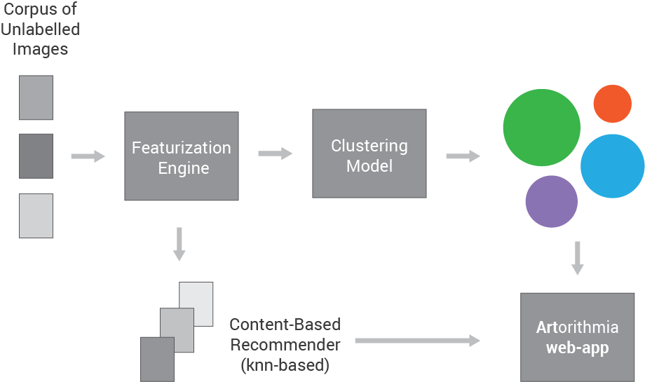
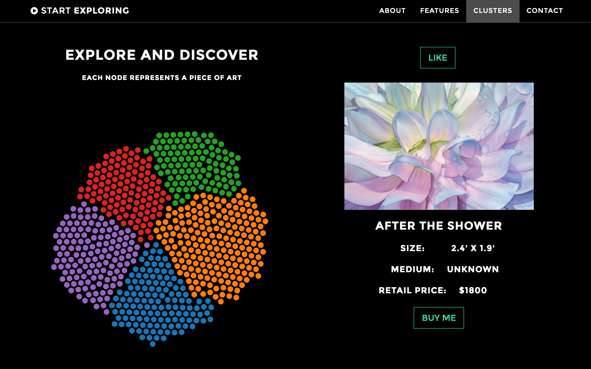
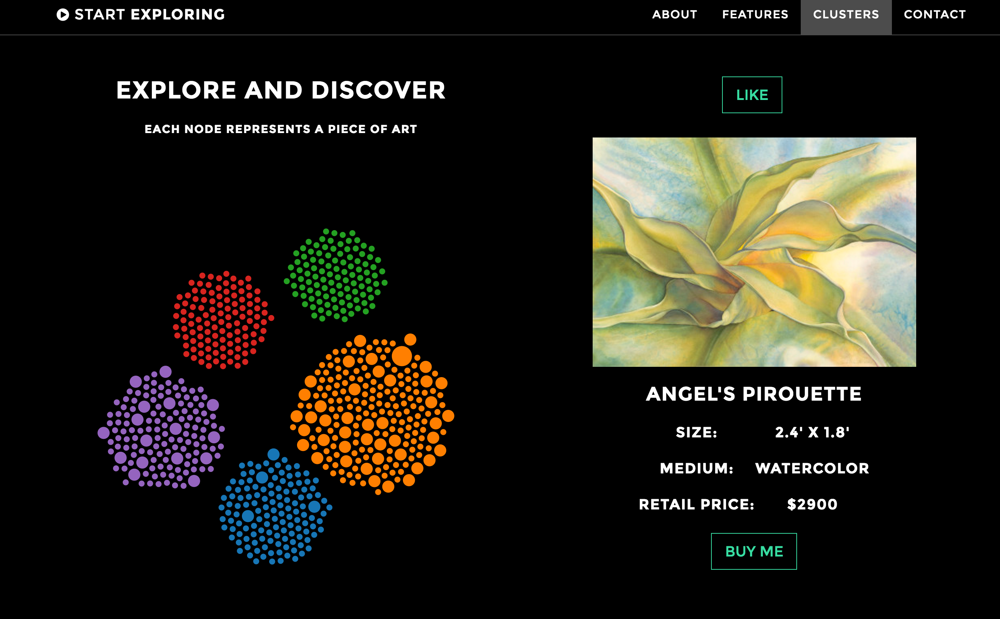
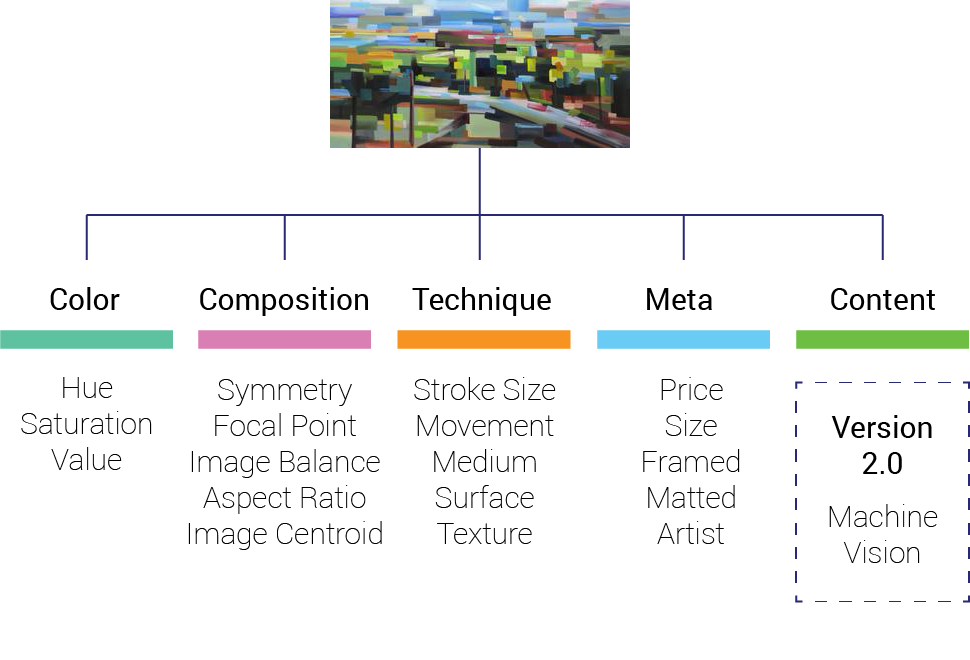

# [Artorithmia](http://www.artorithmia.com)

#### Art Clustering and Recommendation
- Galvanize Data Science - Summer 2016 - Capstone Project - Aaron Lichtner
- *Done in partnership with [Drizl](http://www.drizl.co)*

## Project Motivation

Applying labels to works of art is inherently subjective and often counter-productive. Whether or not a piece is considered *neo-classical* or *post-modern* has little bearing on whether or not a person will actually like or dislike the work. Additionally, labels create barriers to people who may be interested in art but aren't familiar with accepted terminologies. Ideally, we'd like to represent a piece of art using a set of unbiased metrics. **[Artorithmia](www.artorithmia.com)** attempts to do this by extracting features from unlabelled images and representing them using agnostic features.

## Goals
1. **Extract Artwork Features** - Build an artwork featurization engine which pulls information out of a collection of artwork
2. **Cluster Artwork** - Deploy clustering algorithms to quickly group a collection of work by different metrics depending on user requests
3. **Prototype a Recommender** - Use the featurized images and cluster classifications to build a prototype recommendation interface to help users find art that they love

## How to run it

This project currently requires access to the Drizl collection. It will soon be updated to accept any collection of art. Hang tight.

Please send any comments or suggestions to *aaron@aaronlichtner.com*.

## Pipeline

### Feature Engine

A corpus of unlabelled pieces of art from the [Drizl](http://www.drizl.co) collection are fed into the featurization engine where a variety of features are pulled out of each image using python and the skimage module. This process was performed on a compute-optimized EC2 instance. Additional information on features engineering is given below.

### Clustering

The images were then clustered with the cluster engine into k-classes. A number of clustering algorithms from sklearn were applied (Kmeans, DBSCAN and Affinity Propagation). Before clustering, the data was scaled using sklearn's `StandardScaler` module.

### Recommendations

Because no user-data was available, recommendations are provided strictly on an item-content database. A graphlab content-similarity-based recommender was used to compute the similarities between pieces of art using cosine similarity. Both the clustering data and recommender were then deployed on a flask-based webapp using Amazon Web Services.

### d3 and the webapp
Simply using a simple recommender isn't very exciting, Artorithmia employs a bit of d3 magic to make a force-cluster visualization. This is a representation of a multidimensional art corpus projected into two dimensions where the clustering is used to show the breadth of the art corpus. The size of each node in the visualization is a representation of the probability of liking a work based on your previous 'like' history.

At first each node is uniformly sized since my prior for a user liking any one piece is the same. As you 'like' a piece of art however, the nodes will resize based on the score the recommender provides to the user. Larger nodes represent a greater probability of liking a work. Because this visualization presents the entire corpus of work, the user has the unique ability to visually see how their personal preferences affect their predicted preferences of the entire collection. This, to me is the powerful part. Normally a recommender will only present you with items that you like rather than showing how your opinions alter your recommendations for an entire collections.

To build the d3 visualization, a dictionary of values for `item_id`, `url`, `radius`, `cluster_label`, and `item meta data` are passed from the flask app into `index.html` where a "node" is initialized for every piece of art. This way, every single node is associated with an image and metadata and we are able to keep track of what users 'like'. d3's `force.layout` is used to simulate the clustering. Gravity and charge forces are used to keep nodes stable.

## Feature Engineering

The meat and potatoes of Artorithmia comes from the feature engineering, after all, since we aren't using labels to describe our images, well-thought out features must be extracted to describe a piece of art. Upon initialization with an image, an `Art` object is created. When the `build_features` method is called on an `Art` object, five different categories of features are built.

## Tech stack

A variety of technologies were employed for this project. Processing and exploratory data analysis were performed using python and the skimage module deployed on an EC2 instance. Modeling was performed using both sklearn.cluster packages and recommendations were generated using Turi's graphlab. Finally, the web-app was deployed on AWS using a flask-based app with d3 and javascript functionality.

# Future Development
- **A/B Test** the recommendation service to see whether or not users prefer their recommendations to random-choice pieces of art
- Deploy an **open-source API** to allow anyone to use the featurizer and clustering engines developed during this project
- Enlarge the corpus of images to extract features from

## Spin-Offs
- With a larger corpus of images including masterworks, I could implement a "Which master am I most similar to" call which would return a masterwork most similar to a user selected image.
