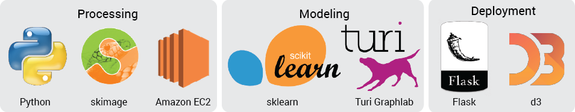

# Artorithmia

#### Art Clustering and Recommendation
- Galvanize Data Science - Summer 2016 - Capstone Project - Aaron Lichtner
- *Done in partnership with [Drizl](www.drizl.co)*

## Project Motivation

Applying labels to works of art is inherently subjective and often counter-productive. Whether or not a piece is considered *neo-classical* or *post-modern* has little bearing on whether or not a person will actually like or dislike the work. Additionally, labels create barriers to people who may be interested in art but aren't familiar with accepted terminologies. Ideally, we'd like to represent a piece of art using a set of unbiased metrics. **[Artorithmia](www.artorithmia.com)** attempts to do this by extracting features from unlabelled images and

## Goals
1. **Extract Artwork Features** - Build an artwork featurization engine which pulls agnostic information out of a collection of work
2. **Cluster Artwork** - Deploy clustering algorithms to quickly group a collection of work by different metrics depending on user requests
3. **Prototype a Recommender** - Use the featurized images and cluster classifications to build a prototype recommendation interface to help users find art that they love

## Pipeline

A corpus of unlabelled pieces of art from the [Drizl](www.drizl.co) collection are fed into the featurization engine where a variety of features are pulled out of each image using python and the skimage module. The images are then clustered with the cluster engine into k-classes. A graphlab content-similarity-based recommender is used to compute the similarities between pieces of art. Both the clustering data and recommender are deployed on a flask-based webapp using Amazon Web Services.

## Create recommendations for users using "taste space"

## Feature Engineering

Upon intiialization with an image, an `Art` object is created. When the `build_features` method is called on an `Art` object, five different categories of features are built.

- Feature Categories:
  - Color features
  - Composition features
  - Technique features
  - Meta features
  - Content features (coming in version 2.0)

## Future Development
- **A/B Test** the recommendation service to see whether or not users prefer their recommendations to random-choice pieces of art
- Deploy an **open-source API** to allow anyone to use the featurizer and clustering engines developed during this project
- Enlarge the corpus of images to extract features from

## Spin-Offs
- With a larger corpus of images including masterworks, I could implement a "Which master am I most similar to" call which would return a masterwork most similar to a user selected image.

## API Calls

- **Return Representative Images**
- **Return Similar Images**
- **Return User Recommendations**

## References
- add list of references to what was used to pull out art features
