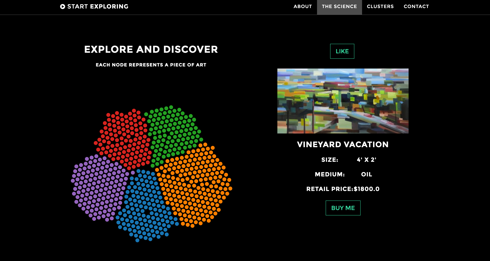

# [Artorithmia Webapp](http://www.artorithmia.com)

### Art Clustering and Recommendation
- Galvanize Data Science - Summer 2016 - Capstone Project - Aaron Lichtner
- *Done in partnership with [Drizl](http://www.drizl.co)*

### What is it?

This is a flask-based webapp build using a bootstrap template and deployed on AWS at [www.artorithmia.com](http://www.artorithmia.com). The webapp is a demo of a potential recommender to be implemented on the [Drizl](http://www.drizl.co) site.

The webapp contains a d3 visualization tied with a Turi content-similarity recommender to indicate how much or how little a user will like a piece of art in the Drizl corpus.

For more information please contact [aaron@aaronlichtner.com](aaron@aaronlichtner.com)
